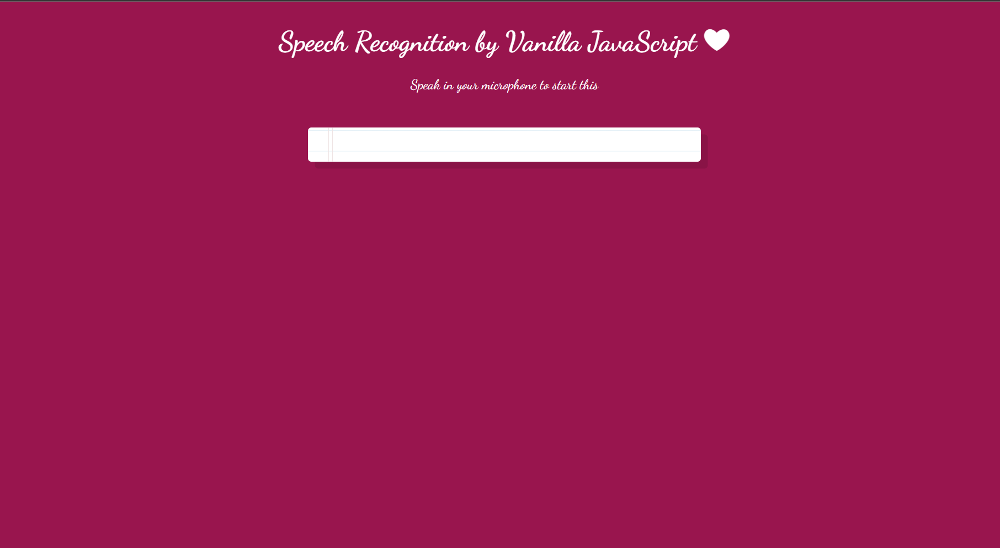

# 🤍 Speech Recognition 🤍

This is a project made via vanilla Javascript, HTML and CSS. It is a speech recogintion website. As the person speaks the website listens and then prints it on the screen.

To run this, clone the repo and use localhost.

# Preview 

